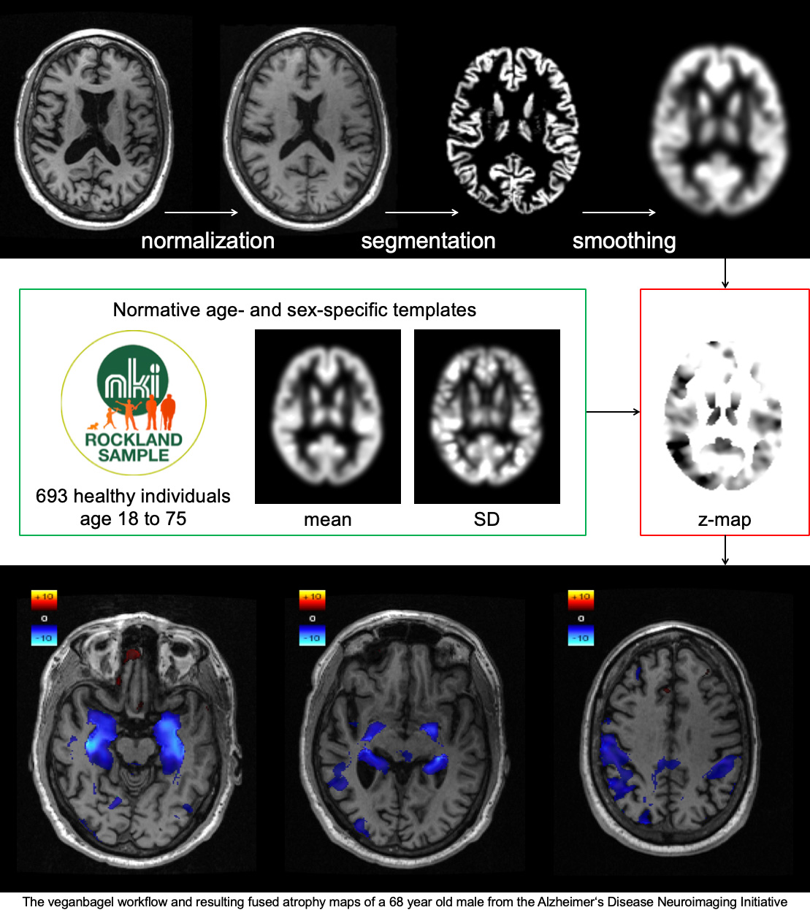

# Brain Imaging Accessoires: Volumetric estimation of gross atrophy and brain age longitudinally (veganbagel)

Estimating regional deviations of brain volume from a patient’s normative age cohort is challenging and entails immense inter-reader variation. We propose an automated workflow for sex- and age-dependent estimation of brain volume changes relative to a normative population.

veganbagel is meant to be used as a submodule of [BrainSTEM](https://github.com/BrainImAccs/BrainSTEM).

Please note, this software is research-only and is not intended for clinical decisions/diagnosis.

# Details

The veganbagel script takes a directory with DICOM files of a non-enhanced 3D T1-weighted structural MR brain scan as input and then generates a map of regional volume changes in relation to an age- and sex-matched cohort of pre-processed normal scans.

Sex- and age-dependent gray-matter (GM) templates based on T1w MRIs of 1,112 healthy subjects between 16 and 77 years of age from the [Enhanced Nathan Kline Institute - Rockland Sample](http://fcon_1000.projects.nitrc.org/indi/enhanced/) were used. Preprocessing using [CAT12](http://www.neuro.uni-jena.de/cat/) for [SPM12](https://www.fil.ion.ucl.ac.uk/spm/software/spm12/) entailed GM-segmentation, normalization to MNI152, 8 mm smoothing and modulation. For each sex and age between 18 and 75 voxel-wise mean and standard deviation template maps were generated with the respective age +/-2.

These templates can then be used to generate atrophy maps for out-of-sample subjects. Preprocessing is done with the same preprocessing pipeline. Voxel-wise Z-value maps are generated, transformed back into the subject space, colour-coded and merged with the original structural MR brain scan. These volume maps will be automatically exported back to the PACS.



# Installation

We recommend installing veganbagel using [Docker](https://www.docker.com). The container will expose a DICOM listener, which will accept and process 3D T1w brain images. The results will be sent back to a DICOM node. For testing, you can for example use [Horos](https://horosproject.org) to send and receive DICOM files.

veganbagel will be made available on the Docker Hub soon. Currently, please download the Dockerfile and then build the image:

```bash
$ docker build -t veganbagel ./
```

# Running

Environment variables may be used to configure aspects of BrainSTEM and veganbagel (please see (`setup.(brainstem|veganbagel).bash`). For example, to have the results sent back to IP 192.168.0.27, port 11112 (AE Title `destination`), you may execute the container as follows:

```bash
$ docker run -it -p 10105:10105/tcp --env called_aetitle=destination --env peer=192.168.0.27 --env port=11112 veganbagel
```

The DICOM node in the container listens on port `10105/tcp` by default.

# Acknowledgements

The main scripts are based on the [BASH3 Boilerplate](http://bash3boilerplate.sh).
